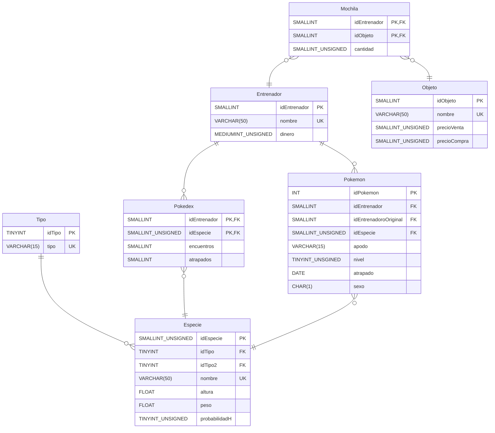

```mermaid
    erDiagram
        Tipo {
            TINYINT idTipo PK
            VARCHAR(15) tipo UK
        }

        Especie {
            SMALLINT_UNSIGNED idEspecie PK
            TINYINT idTipo FK
            TINYINT idTipo2 FK
            VARCHAR(50) nombre UK
            FLOAT altura
            FLOAT peso
            TINYINT_UNSIGNED probabilidadH
        }

        Tipo ||--o{ Especie : ""

        Pokedex {
            SMALLINT idEntrenador PK, FK
            SMALLINT_UNSIGNED idEspecie PK, FK
            SMALLINT encuentros
            SMALLINT atrapados
        }

        Pokedex }o--|| Especie : ""

        Pokemon {
            INT idPokemon PK
            SMALLINT idEntrenador FK
            SMALLINT idEntrenadoroOriginal FK
            SMALLINT_UNSIGNED idEspecie FK
            VARCHAR(15) apodo
            TINYINT_UNSGINED nivel
            DATE atrapado
            CHAR(1) sexo
        }

        Pokemon }o--|| Especie : ""

        Entrenador {
            SMALLINT idEntrenador PK
            VARCHAR(50) nombre UK
            MEDIUMINT_UNSIGNED dinero
        }

        Entrenador ||--o{ Pokedex :""
        Entrenador ||--o{ Pokemon :""

        Objeto {
            SMALLINT idObjeto PK
            VARCHAR(50) nombre UK
            SMALLINT_UNSIGNED precioVenta
            SMALLINT_UNSIGNED precioCompra
        }
        
        Mochila {
            SMALLINT idEntrenador PK, FK
            SMALLINT idObjeto PK, FK
            SMALLINT_UNSIGNED cantidad
        }

        Mochila }o--|| Entrenador : ""
        Mochila }o--|| Objeto : ""
```